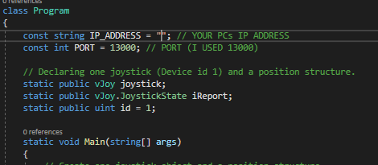
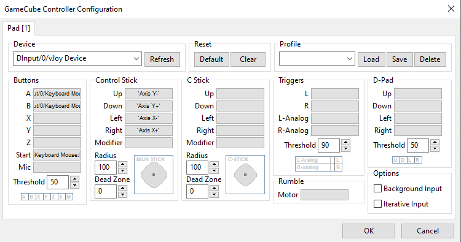

# Super Monkey Ball Hand Controller
Source code for the hand controller I developed for my [YouTube channel](https://www.youtube.com/channel/UCpMEl3fMadASxtf1keCHYww). It was developed mainly to play the game Super Monkey Ball

## PI Code
Requirements:
- Raspberry PI 4
- [I2C](https://learn.adafruit.com/adafruits-raspberry-pi-lesson-4-gpio-setup/configuring-i2c) Enabled
- Python 3
- [mpu6050-raspberrypi](https://pypi.org/project/mpu6050-raspberrypi/) python module

Instructions:
- Add [script](PICode/mpu6050_client.py) to which ever directory you'd like on your PI
- Run command:
```
python3 mpu6050_client.py [IP OF PC RUNNING vJOY FEEDER PROJECT] [PORT]
```

## vJoyFeeder:
Requirements:
- vJoy

Instructions:
- Change IP variable to the IP of your PC
- Change PORT if you want to use a different port



## Emulator
Requirements:
- Dolphin
- Super Monkey Ball ROM

Instructions:
- Here's the input mapping I used for this project:


## Links:
YOUTUBE: https://www.youtube.com/channel/UCpMEl3fMadASxtf1keCHYww </br>
INSTAGRAM: https://www.instagram.com/grego_io/ </br>
TWITTER: https://twitter.com/grego_i0 </br>
TIKTOK: https://www.tiktok.com/@grego_io?lang=en

## License:
This project is under the [MIT License](LICENSE)
